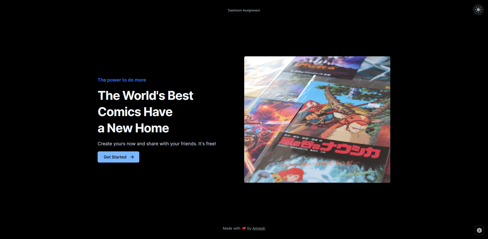
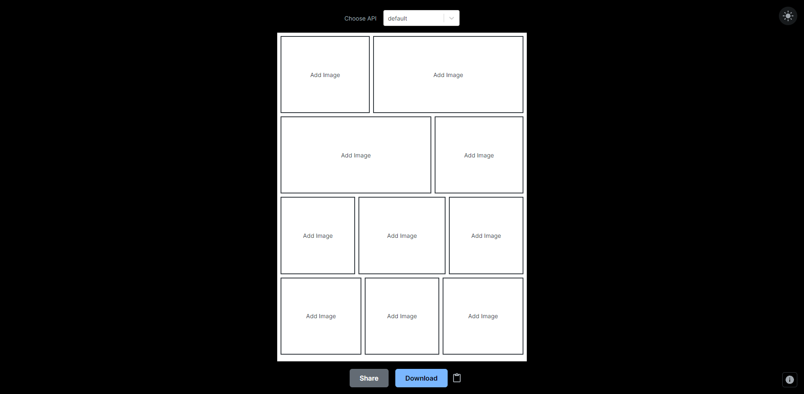
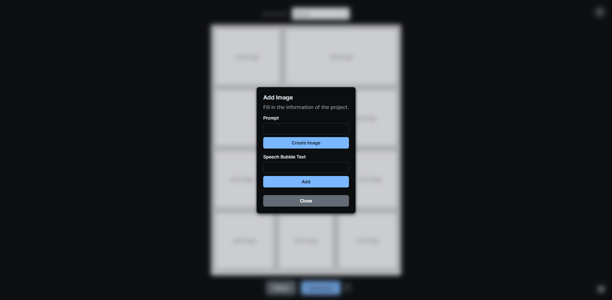
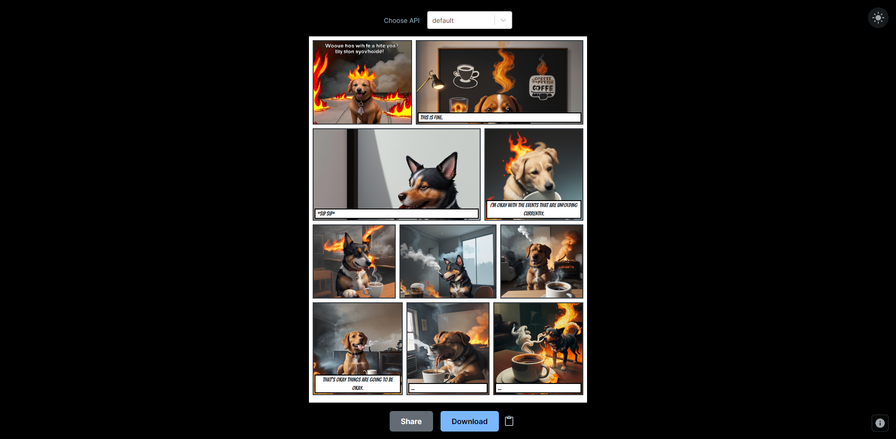
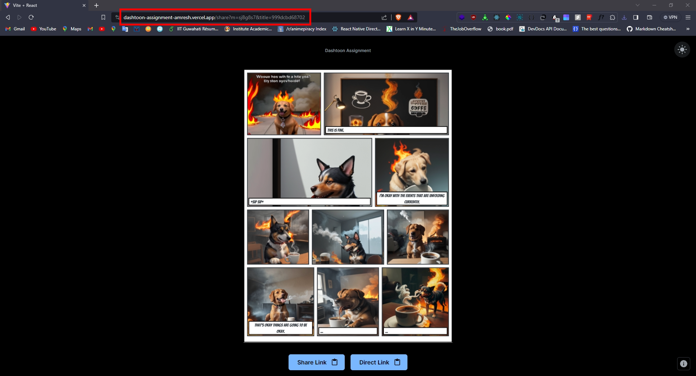

    

# Dashtoon Assignment

- **Link:** [Dashtoon Assignment][(https://dashtoon-assignment-amresh.vercel.app/)](https://dashtoon-assignment-j9u2v6rfd-parashuram-78.vercel.app/)
- **Name:** Ankur Shukla
- **Email:** ankur.shukla.met19@itbhu.ac.in
- **Roll No.:** 19144008
- **College:** IIT BHU Varanasi

## Table of Contents

- [Features & Todo](#features--todo)
- [Usage](#usage)
- [Installation](#installation)
- [Screenshots](#screenshots)
- [Built With](#built-with)

## Features & Todo

### Features:

- Responsive
- Light Mode (default) / Dark Mode
- 10-Panel Grid
- Speech Bubble Support
- Download Option, Shareable Link (web share, direct link)
- Option for 2 Models:
  - default: Provided in the assignment
  - comic-diffusion: Added because the default one was not working or working very slow

### Todo:

- [ ] Add more layouts
- [ ] More customizable speech bubbles
- [ ] Pages

## Usage

1. Click on the "Get Started" button on the Home Page.
2. In the 10-panel grid, click on the panel in which you want to add an image and a speech bubble. Don't close the grid until the image generation notification arrives. Repeat this for all the required panels.
3. Once done, click on either the "Share," "Download," or "Copy" button as per your needs.
4. On clicking the "Share" button, you will be redirected to the third screen where you can see the image. The page link is shareable. You can either copy that or use the direct link buttons at the bottom.

## Installation

1. Clone the repo.
2. Run `yarn install` to install all the dependencies.
3. Rename `.env.sample` to `.env.local` and fill in the necessary secrets.
4. Run `yarn dev` to start the development server.

## Screenshots

    
    
    
    
    

## Built With

- [React.js](https://reactjs.org/)
- [React-Router](https://reactrouter.com/)
- [Mui](https://mui.com/)
- [Html2Canvas](https://html2canvas.hertzen.com/)
- [React-Toastify](https://fkhadra.github.io/react-toastify/introduction)
- [Hugging Face API](https://huggingface.co/)
